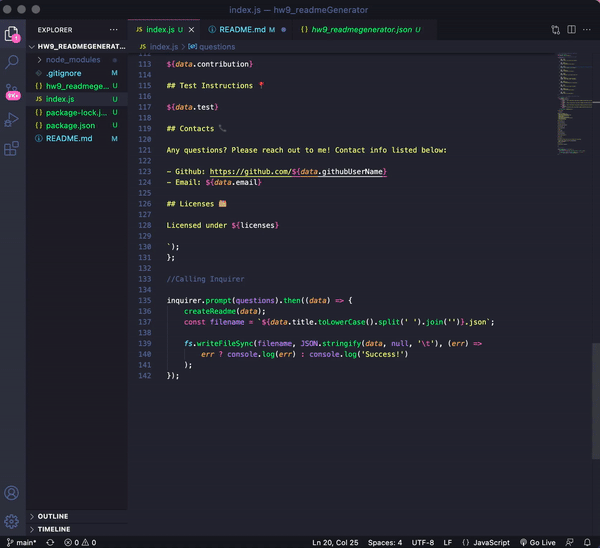

# hw9_readmeGenerator

# Description

- Generator that assists users in quickly creating a professional README.md file 

# Site Demo

# Links

- Repository: https://github.com/mxhuisken/hw9_readmeGenerator
- Node Generated README: 

# Requirements

- Uses inquirer package
- Accepts user input through command line
- User input creates:
    - Project title - txt input
    - Description - txt input
    - Table of Contents - when clicking on links, user taken to corresponding sections
    - Installation instructions - txt input
    - Usage information - txt input
    - License - list options, badges added near top of readme based on user selection & notice added to section to explain which licenses the app is covered under
    - Contribution guidelines - txt input
    - Test instructions - txt input
    - Questions: asks user for github username and adds link to profile / ask user for email then add to section with instructions on how to reach user for additional questions